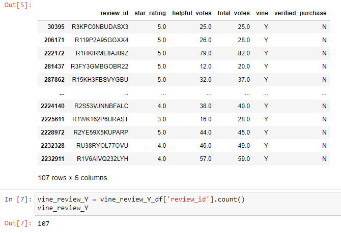
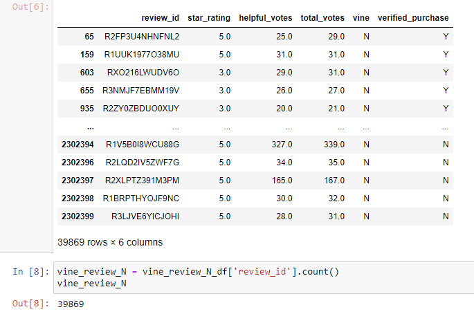
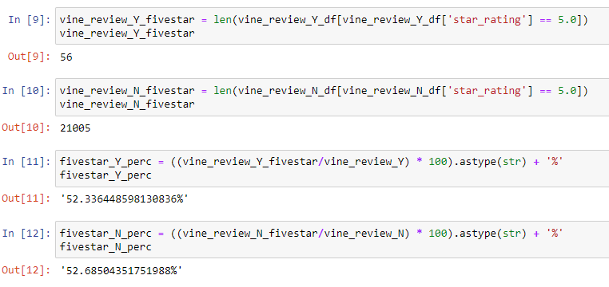

# Amazon-Vine-Analysis
## Overview of the analysis:
The primary purpose of this analysis was to perform an ETL by first, extracting a large data set from amazons product reveiw data set into a PySpark data frame utilizing google Colab Notebook. Then to transfer the data frame into tables that matched the schema that was created in PgAdmin. To then load the data in to PgAdmin and convert to separate csv files that could then be analyzed utilizing Pandas and Jupyter Notebook to find if there is a bias towards favorable reviews from Vine members.
## Results: 
### How many Vine reviews and non-Vine reviews were there? 
Out of 43,574 reviews with total votes equaling 20 or greater there were only 107 reviews by vine members, while the remaining 39,869 reviews were not members. 
# 
# 
### How many Vine reviews were 5-stars? How many non-Vine reviews were 5 stars?
There were 56 5-star reviews by vine members and 21,005 by non-members. (see image below)
### What percentage of Vine reviews were 5 stars? What percentage of non-Vine reviews were 5 stars?
Both vine members and non-members had a 5-star rating ratio of 52%.
# 
## Summary: 
Overall, with the analysis that was performed it seems that there is no review bias between vine members and non-vine members. What additional value does providing a vine membership to consumers provide the suppliers since there seems to be a large volume of reviews already. An analysis that could provide more insight into the benefits of Vine member reviews would be to analyze the reviews themselves to search for key words or descriptors that would help the manufacturer improve the quality and design of their products. This analysis would also have to be tailored to each different type of product. An example such as shoes would be looking for key words like comfort or traction, counting them and then comparing the review words to the star-rating to see how the product performed.

